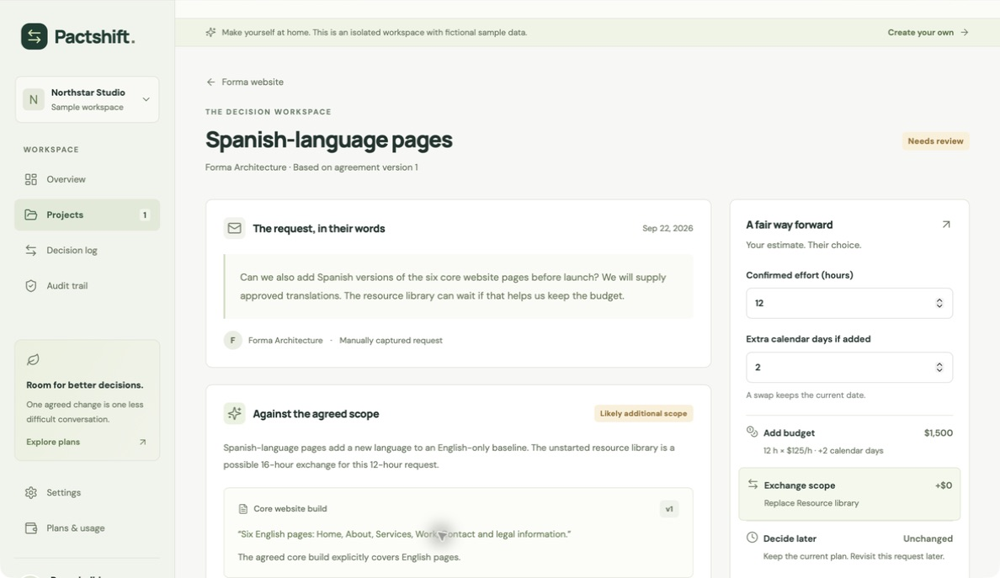
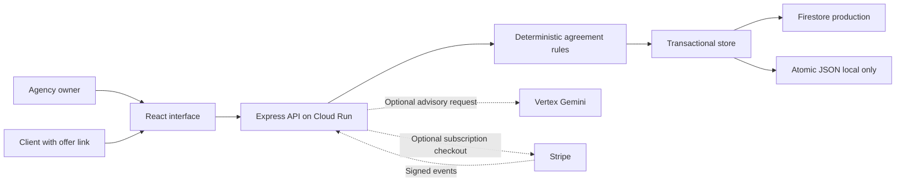

# Pactshift

**Turn “one more thing” into a choice everyone agrees to.**

Pactshift helps small web and design agencies handle a change request before it quietly changes the project. A client can add budget, exchange planned deliverables, or defer. Acceptance updates the saved agreement, including its scope, budget, and delivery date.

**[Open the live application](https://pactshift-wh46bdeima-uc.a.run.app)** · **[Executive brief](deliverables/Pactshift-brief.pdf)** · **[Pitch deck](deliverables/Pactshift-pitch.pptx)** · **[Demo script](docs/DEMO_SCRIPT.md)**

**[Start here: Shivam’s handoff guide](START_HERE.md)**

Built for **Galuxium Nexus V2** by **Shivam Gupta**, founder and project owner, with substantial AI coding and research assistance.



## Try the decision that changes the plan

Choose **Explore the live demo** for an isolated workspace with fictional data. No account or payment details are needed. Demo data and links expire after 24 hours.

Northstar Studio is delivering a $12,000 website for Forma Architecture. The client asks for 12 hours of Spanish-language pages. The agency offers three choices:

| Choice | Consequence |
| --- | --- |
| Add the work | An additional $1,500 at the agreed $125/hour rate, with two extra calendar days. |
| Exchange scope | Replace a planned 16-hour resource library with the 12-hour request. Budget and due date stay fixed. |
| Defer | Keep the current agreement and record the request for reference. |

Open the seeded request, review its estimate, create a client decision link, and open that link in another tab. Choose the exchange. Return to the project to see baseline version two: the resource library is exchanged, Spanish pages are included, and total estimated scope moves from 96 to 92 hours. A printable client receipt and JSON exports make the result inspectable.

Those numbers describe sample project state. They are not customer savings, time actually worked, or Pactshift revenue.

## Release status

This is an **early production release with explicit limits**, not an enterprise certification or an unlimited-scale service. Evidence recorded on **22 September 2026**:

| Item | State |
| --- | --- |
| Public deployment | Cloud Run revision `pactshift-00003-k8c`; 21 hosted release checks passed. [Evidence](docs/RELEASE_EVIDENCE.json) / [deployment](docs/DEPLOYMENT.json). |
| Durable storage | Named Firestore database; deployed demo returned Firestore capability. Native adapter smoke covered serialization, concurrent updates, and rollback. |
| Automated checks | 30 focused tests passed: 26 backend and 4 frontend. Clean-install [GitHub CI passed](https://github.com/shi1720/Galuxium-Nexus-V2/actions/runs/35687887776), including build and zero-vulnerability dependency audit. |
| AI | Final hosted smoke executed `vertex` / `gemini-2.5-flash-lite`; citation count is recorded in the release evidence. Each analysis identifies the actual engine used. |
| Browser workflow | Local Safari: publish proposal → client accepts swap → $12,000 / October 20 / version two receipt → updated owner project verified. Hosted Cloud Run workflow was verified separately through the real API; a final hosted browser/mobile check is not claimed. |
| Payments | Intentionally disabled until merchant configuration is supplied. Paid plans are proposed; no live charge is claimed. |
| Traction | Zero verified customers and $0 verified revenue. |
| Demo video | Narration and storyboard prepared; finished video is still required for submission. |

## What works

- Registration, login, logout, and recovery using a one-time private recovery code.
- An owner workspace with structured projects, deliverables, estimates, dependencies, and protection settings.
- Forward-only deliverable progress; started, essential, and dependent work is protected from inappropriate exchanges.
- Request analysis against deliverables and project scope boundaries, with exact-source citation checks and a labeled rules fallback.
- Human review of estimates and options before sharing; all fees calculated on the server.
- Expiring, revocable client links with no client signup requirement.
- Atomic add/swap/defer decisions, stale-baseline rejection, and repeat-acceptance protection.
- Historical scope, budget, and delivery dates; linked audit events; private workspace and public decision exports.
- Archive/restore, workspace rename, and account/workspace deletion.
- Optional Stripe subscription checkout, customer portal, signed webhook validation, and entitlement updates.

The owner supplies or confirms the estimate. AI cannot approve work, choose the fee, or bypass agreement rules. A client acknowledgement identifies the name entered by the link holder; it is not independently verified identity, a certified signature, or proof of payment.

## Run locally

Prerequisites: **Node.js 22** and npm. Cloud credentials and payment keys are unnecessary for the local workflow.

```bash
git clone https://github.com/shi1720/Galuxium-Nexus-V2.git
cd Galuxium-Nexus-V2
npm ci
npm run dev
```

Open [localhost:5173](http://localhost:5173). Vite serves the interface and proxies `/api` to Express on port 8080. The default local adapter saves state to `.data/pactshift.json`; the rules engine runs locally. Start with the sample workspace or register an account. Save the recovery code displayed at registration: email-based password reset is not implemented.

[.env.example](.env.example) documents available settings. The server reads process environment variables; copying that file alone does not load them. Set required overrides in your shell or deployment environment. Defaults are sufficient for `npm run dev`.

To run the compiled application locally:

```bash
npm run build
npm start
```

Open [localhost:8080](http://localhost:8080). This command remains local development mode unless `NODE_ENV=production` is supplied. Production startup requires an HTTPS `APP_ORIGIN` and the Firestore adapter; it refuses to use the local JSON file as cloud persistence.

## Tests and build

```bash
npm test
npm run typecheck
npm run build
```

Tests use isolated local state and cover account lifecycle, tenant isolation, CSRF/origin checks, capability expiry and revocation, prices, progress/dependencies, swaps, concurrent and repeated approvals, immutable historical dates, quotas, audit/citation validation, AI deadlines/fallback, and signed billing events. They do not contact Stripe or establish that a particular cloud deployment is healthy.

A separate native Firestore smoke verified nested data roundtrip, hash consistency after map serialization, concurrent increments, and rollback. Production release verification also requires the actual runtime identity and browser workflow. Read [OPERATIONS.md](docs/OPERATIONS.md) for checks and recovery procedures.

## Architecture



| Layer | Technology / decision |
| --- | --- |
| Interface | React 19, React Router, Vite, TypeScript, Lucide icons, locally hosted fonts. |
| API | Node.js 22, Express 5, Zod validation, Helmet, cookie sessions. |
| Domain | Server-owned integer currency arithmetic and explicit workflow transitions. |
| Persistence | Firestore native transactions; serialized atomic-file adapter for one local process. |
| Analysis | Optional Vertex Gemini 2.5 Flash-Lite; exact-substring citations; 12-second fallback boundary. |
| Authentication | bcrypt password hashes, hashed random session/recovery tokens, CSRF and exact-origin checks. |
| Billing | Optional Stripe-hosted subscriptions and portal; signed, replay-safe webhook processing. |
| Verification | Vitest, Supertest, TypeScript, explicit Firestore and browser smoke checks. |
| Packaging | Multi-stage Docker build; non-root runtime; same-origin client/API deployment. |

The bounded workspace aggregate makes a scope change, baseline snapshot, and audit event one transaction. That simplifies correctness for small accounts, while creating an intentional storage and write-contention limit. Larger accounts would require a migration to separate project/event collections. [Architecture and schema](docs/ARCHITECTURE.md)

## Data model

The canonical public types live in [shared/types.ts](shared/types.ts). Firestore stores logical records as `pactshift/{base64url(logicalKey)}` documents with a `value` object and, for expiring records, a top-level TTL timestamp.

| Entity | Important fields |
| --- | --- |
| User | Identity, workspace ownership, demo flag; private stored record also holds password/recovery hashes and session references. |
| Workspace | Owner, name, plan, usage month/count, projects, creation time. |
| Project | Client, scope boundaries, currency, budget/rates, capacity, due date, version, deliverables, requests, baselines, audit. |
| Deliverable | Acceptance description, estimated hours, status, protection flag, prerequisite IDs. |
| Change request | Client text, analysis, confirmed hours, server fee, proposed swap IDs, schedule change, state, baseline version, decision record. |
| Baseline | Version, reason, timestamp, budget, due date, copied deliverables. |
| Audit event | Actor, action, detail, timestamp, previous hash, current SHA-256 hash. |

Passwords, recovery hashes, session secrets, and private link tokens are excluded from workspace exports. Public offers exclude internal cost rates, unrelated requests, and private audit data. Complete logical keys and state machines appear in [ARCHITECTURE.md](docs/ARCHITECTURE.md).

## API example

This example creates an isolated local demo, shares its seeded proposal, then applies its swap. It requires `curl` and `jq`, with the local server running. Keep the temporary cookie/token files private; never paste real client links into issues.

```bash
pactshift_tmp=$(mktemp -d)
curl --fail --silent --show-error \
  -c "$pactshift_tmp/cookies" \
  -H 'Origin: http://localhost:5173' \
  -H 'Content-Type: application/json' \
  -d '{}' http://localhost:8080/api/auth/demo \
  -o "$pactshift_tmp/bootstrap.json"

pactshift_csrf=$(jq -r '.csrfToken' "$pactshift_tmp/bootstrap.json")
pactshift_project=$(jq -r '.workspace.projects[0].id' "$pactshift_tmp/bootstrap.json")
pactshift_request=$(jq -r '.workspace.projects[0].requests[0].id' "$pactshift_tmp/bootstrap.json")

curl --fail --silent --show-error \
  -b "$pactshift_tmp/cookies" \
  -H 'Origin: http://localhost:5173' \
  -H "X-CSRF-Token: $pactshift_csrf" \
  -H 'Content-Type: application/json' \
  -d '{}' \
  "http://localhost:8080/api/projects/$pactshift_project/requests/$pactshift_request/share" \
  -o "$pactshift_tmp/offer.json"

pactshift_offer=$(jq -r '.shareToken' "$pactshift_tmp/offer.json")
curl --fail --silent --show-error \
  -H 'Origin: http://localhost:5173' \
  -H 'Content-Type: application/json' \
  -d '{"choice":"swap","clientName":"Alex — sample client","acknowledged":true}' \
  "http://localhost:8080/api/offers/$pactshift_offer/decide"
```

Expected result includes `ok: true`, `choice: "swap"`, and `version: 2`. Repeating the same decision does not duplicate work. Choosing a different outcome afterward returns a conflict. Delete the temporary files when finished. API errors use `{error, code?}`. [Route reference](docs/ARCHITECTURE.md#api-reference)

## Proposed plans and limits

| Plan | USD/month | Stored projects | Analyses/month |
| --- | ---: | ---: | ---: |
| Free | $0 | 3 | 30 |
| Studio | $29 | 15 | 300 |
| Agency | $79 | 60 | 1,500 |

Archived projects still count as stored projects. Every plan has **720,000 bytes of serialized workspace capacity**, and each project allows up to 30 requests, 80 deliverables, 50 baselines, and 100 audit events. The first limit reached applies. Client approvals have no per-seat or percentage fee, within those bounds. “Agency” is a capacity tier, not a promise of multi-user roles.

Paid checkout is disabled on the current deployment. Read the [business model and cost assumptions](docs/BUSINESS.md), [competitor/source pack](docs/MARKET.md), and [validation plan](docs/VALIDATION_PLAYBOOK.md). No customer or revenue claim is made.

## Repository map

```text
client/                 Browser interface and styles
server/                 API, domain, validation, analysis, persistence
shared/                 Shared domain types
tests/                  Domain, HTTP, and advisory analysis checks
public/                 Icons and locally hosted font assets/licenses
docs/                   Architecture, operations, business, submission
scripts/artifacts/      Reproducible brief and presentation generators
deliverables/           Executive PDF and editable pitch deck
Dockerfile              Build and runtime image
```

## Security, operations, and contribution

Read [SECURITY.md](SECURITY.md) for the threat model and reporting procedure, [OPERATIONS.md](docs/OPERATIONS.md) for deployment and recovery, and [CONTRIBUTING.md](CONTRIBUTING.md) before changing agreement rules. The [internal judge review](docs/JUDGE_REVIEW.md) records weaknesses found and the resulting fixes; its scores are estimates, not official judging results.

This release has no MFA, email verification, independently verified signatures, advanced team roles, automatic contract-file extraction, email/Slack ingestion, or collection of agency client payments. PITR is configured for the named database, but a full operational restore exercise and sustained-load certification are not claimed. No SLA or compliance certification is offered.

The [submission pack](docs/SUBMISSION.md) maps deliverables to the event rubric. The mandatory demo video still needs recording and a playable link before submission. Application code and documentation are provided under the [MIT License](LICENSE). Third-party libraries retain their own licenses; font license notices are included with the font assets.
