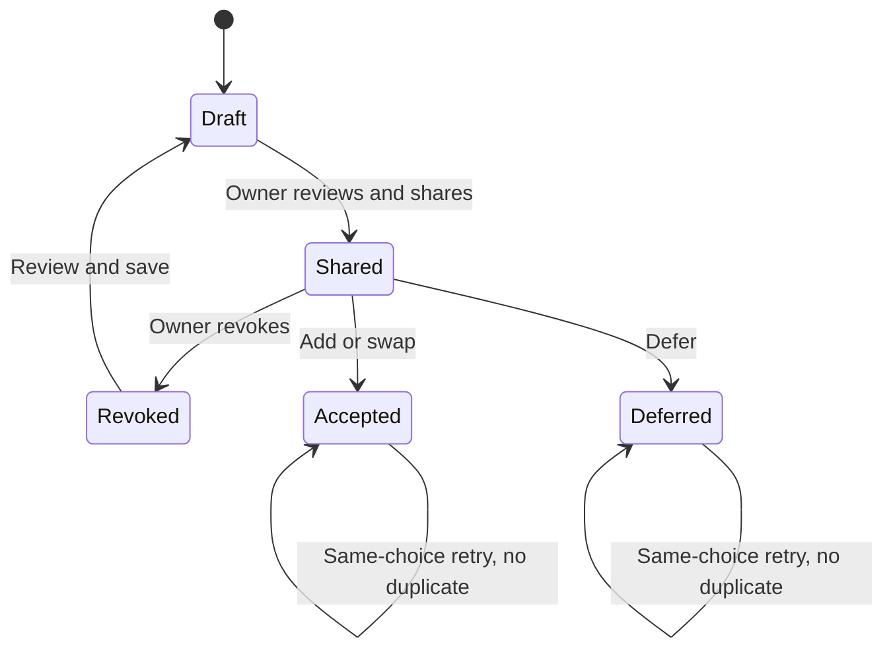

# Pactshift architecture

**22 September 2026 · Early production release**

Pactshift's central invariant is that a client's accepted option changes the saved project exactly once, against the agreement they reviewed. Advisory text, price calculation, client authorization, and persistence are separate responsibilities.

## Request and decision path

```mermaid
sequenceDiagram
    participant O as Owner browser
    participant A as Express API
    participant D as Domain rules
    participant F as Transactional store
    participant M as Optional Vertex model
    participant C as Client browser
    O->>A: Capture request with owner estimate
    A->>F: Check tenant and quotas; persist draft
    A->>M: Bounded scope/request analysis
    M-->>A: Advisory structured output
    A->>A: Validate citations or use rules fallback
    A->>F: Save analysis if baseline/draft still current
    O->>A: Review, save, share
    A->>F: Validate options; save expiring capability
    C->>A: Read limited offer
    C->>A: Choose add, swap, or defer
    A->>F: Begin transaction
    A->>D: Check token, state, version, and eligibility
    D->>F: Update agreement + snapshot + audit
    F-->>A: Commit, or retry on conflict
    A-->>C: Decision receipt
```

AI execution happens outside the database transaction. A slow or retried model request cannot hold the agreement lock. When its result returns, the API saves it only if the relevant draft and baseline still match.

## Components and ownership

| Component | Responsibility | Must not do |
| --- | --- | --- |
| React client | Forms, review, before/after presentation, readable errors, exports. | Authorize tenants or supply a trusted price. |
| Express API | Sessions, origin/CSRF checks, Zod validation, capabilities, rate limits. | Treat model suggestions as authorization. |
| Domain module | Eligibility, server arithmetic, state transitions, snapshots, audit hashes. | Depend on browser validation. |
| Store adapter | Commit or roll back the complete mutation. | Partially apply a decision. |
| Analysis module | Bounded advisory interpretation with exact-source evidence. | Approve scope, set fees, execute tools, or alter records directly. |
| Stripe adapter | Optional subscription checkout and verified entitlement events. | Treat an unverified browser redirect as payment success. |

## Storage layout

The Firestore collection is `pactshift`. Document IDs encode a logical key using base64url. Each document contains `value`; expiring records also contain a top-level `expiresAt` Firestore timestamp. This indirection keeps the storage adapter small and makes the local and cloud domain representation consistent.

| Logical key | Stored value |
| --- | --- |
| `users/{id}` | Public user fields plus password hash, recovery hash, bounded session references, session version, creation time. |
| `workspaces/{id}` | Owner, plan, usage counter, all projects and their history. |
| `emails/{SHA256(email)}` | User ID lookup. Email is normalized before lookup. |
| `sessions/{SHA256(token)}` | User ID, CSRF token, expiry, session version. |
| `shares/{SHA256(token)}` | Workspace/project/request IDs and expiry. |
| `limits/{SHA256(purpose:IP)}` | Rate counter and window expiry. |
| `billing/{workspaceId}` | Stripe customer/subscription references and event-ordering state. |
| `stripeEvents/{eventId}` | Replay marker with retention expiry. |
| Daily AI/demo counters | Global admission controls and expiry. |

Private owner bootstrap data includes workspace capability links so the owner can share or revoke them. Exports deliberately remove those tokens. The separate share lookup stores a hash, while the owner workspace holds the original capability. Treat workspace access and provider logs accordingly.

The full public schema is [shared/types.ts](../shared/types.ts). Baselines copy **budget, due date, and deliverables** at each version. Request evidence refers to a deliverable ID or the project's scope-boundary source ID; quotes must exist in the corresponding saved text.

## State machines



A shared request is not edited in place. The owner revokes it, reviews changes against the current project, and creates a new link. Stale draft review regenerates rule evidence. Sharing and acceptance require a matching baseline version. Expiry does not invent a new request state; an expired capability simply cannot authorize a decision.

Deliverable status progresses `planned → in_progress → done`. It cannot move backward. A valid exchange moves a selected planned item to `swapped`, preserving its record. A swapped item cannot reactivate. Prerequisites must be completed before dependent work starts. Progress/protection changes create a new baseline version and invalidate older offers.

## Decision invariants

1. Private mutation identity must own the workspace. Foreign project IDs are not sufficient authority.
2. An offer decision requires an unexpired capability, a shared request, a current baseline, and explicit acknowledgement.
3. Fees equal rounded confirmed hours × the saved integer rate. Client-supplied arbitrary fee fields are rejected.
4. Swap IDs are unique, belong to the project, and identify planned, unlocked work without non-swapped dependents. Their total estimate covers the new request. There are no partial swaps.
5. Add increases the budget, shifts the due date by the agreed calendar days, and inserts one deliverable.
6. Swap preserves budget/date, marks selected items exchanged, and inserts one deliverable.
7. Defer records the decision without changing the baseline.
8. Accepted request, new baseline, and audit record commit together. Conflicting approvals cannot both apply to the same old version.
9. Repeated acceptance of the same choice is idempotent; a different choice conflicts.
10. Bounds fail explicitly and roll back. History is never silently truncated to fit.

Public offer values come from the request's source baseline, so a later accepted addition cannot rewrite an earlier receipt's budget or date. The receipt calculates the accepted after-state from that historical before-state and the recorded choice.

## Transaction adapters

**Local:** `LocalStore` serializes transactions through one process queue, copies staged values, and atomically renames the JSON file after success. A thrown mutation commits nothing. It is for local development, not shared disks, multiple Node processes, or Cloud Run instances.

**Firestore:** reads and deferred writes participate in a native transaction. Conflicts retry against current data. The adapter preserves nested application arrays through its Firestore representation and verifies audit hashes through canonical field ordering. See the adapter and native smoke record in [server/README.md](../server/README.md).

One bounded workspace aggregate makes the critical update simple and coherent. Its limits are real: a busy workspace becomes a contention point, and repeated full snapshots consume storage. Cloud Run instance scaling does not remove either limitation. A future version should separate projects and append-only events while keeping decision, entitlement, and version checks transactional.

## AI boundary

Vertex is optional. The configured model is `gemini-2.5-flash-lite`, with a 1,600-token output cap and a 12-second deadline covering credential/model work. The request includes relevant project boundaries, current deliverables, client text, and the owner's estimate. It excludes internal cost rates and account credentials.

Output must match the schema. Every citation must identify a supplied source and quote an exact substring. “Included” without supporting evidence is rejected. Invalid output, provider failures, unavailable credentials, or a timeout return the labeled rules comparison. This validation checks grounding, not semantic correctness or calibrated confidence. Owners still review the result.

The global attempt cap defaults to 200/day, in addition to plan and network rate limits. An exhausted model budget can yield rules analysis; the interface records the actual engine. The model is never required for accepting an already reviewed offer.

## API reference

Prefix: `/api`. JSON errors: `{ "error": "Readable message", "code": "OPTIONAL_CODE" }`. Mutations require the configured `Origin`; authenticated mutations also require `X-CSRF-Token` from bootstrap. Stripe's webhook is separately authenticated by its signature and raw body.

| Method / route | Input / result |
| --- | --- |
| `POST /auth/register` | `{name,email,password,workspaceName}` → bootstrap and one-time recovery code. |
| `POST /auth/login` | `{email,password}` → bootstrap and session cookie. |
| `POST /auth/demo` | `{}` → isolated fictional workspace. |
| `POST /auth/recover` | `{email,recoveryCode,password}` → new session and rotated recovery code. |
| `POST /auth/logout` | `{}` → session invalidated. |
| `GET /bootstrap` | Owner identity, workspace, capabilities, CSRF token. |
| `POST /projects` | Structured project with currency, integer budget/rates, date, capacity, and deliverables. |
| `PATCH /projects/:id` | `{archived}`. Archived projects still count toward stored-project quota. |
| `PATCH /projects/:id/deliverables/:did` | `{status?,locked?}` with forward-state and dependency checks. |
| `POST /projects/:id/requests` | `{title,message,hours}` → saved draft with server analysis. |
| `PATCH /projects/:id/requests/:rid` | `{hours?,swapIds?,note?,scheduleDays?}` → reviewed draft; fee recalculated. |
| `POST /projects/:id/requests/:rid/share` | `{}` → request with new expiring link token. |
| `POST /projects/:id/requests/:rid/revoke` | `{}` → old link invalidated. |
| `GET /offers/:token` | Limited public offer anchored to its source baseline. |
| `POST /offers/:token/decide` | `{choice,clientName,acknowledged:true}` → recorded result/version. |
| `GET /export` | Workspace JSON attachment without credentials or private link tokens. |
| `PATCH /workspace` | `{name}`. |
| `DELETE /workspace` | `{confirmation: exactWorkspaceName}` → owner and workspace removed; active paid subscription must first be cancelled. |
| `POST /billing/checkout` | `{plan:"studio"|"agency"}` → provider URL, or explicit unavailable response. |
| `POST /billing/portal` | `{}` → customer portal URL when configured. |
| `POST /billing/webhook` | Raw signed subscription event; replay and ordering checks. |
| `GET /health` | Minimal readiness result after a store read. |

Creation dependencies use earlier deliverable indices as strings, such as `dependsOn: ["0"]`; the API maps them to generated IDs. This prevents cycles and forward references at creation. Full field bounds are in [server/validation.ts](../server/validation.ts).

## Explicit bounds

| Resource | Limit |
| --- | ---: |
| Workspace serialized application data | 720,000 bytes |
| JSON request body | 100 KB |
| Requests per project | 30 |
| Deliverables per project | 80 total; at most 40 at initial API creation |
| Baselines per project | 50 |
| Audit events per project | 100, with capacity reserved for shared decisions |
| Initial project estimate | 5,000 hours total |
| Stored projects | Free 3; Studio 15; Agency 60 |
| Analyses/month | Free 30; Studio 300; Agency 1,500 |

The first applicable limit wins. The interface may use a lower convenient form limit than the API. Archiving hides a project from active views; it does not reclaim stored capacity. There is no per-project delete workflow or JSON import/restore UI in this release.

## Security and operational limits

The public cloud service accepts network requests, while private data remains behind application authentication and ownership checks. Firestore server access is IAM-based; the browser never connects directly to Firestore. Provider account administrators remain trusted. A hash chain can reveal changes against an independently held export, but an administrator who can rewrite the entire chain is not prevented by hashing alone.

See [SECURITY.md](../SECURITY.md) for the threat model and [OPERATIONS.md](OPERATIONS.md) for actual deployment configuration, verification, retention, and incident response. No high-availability, compliance certification, or independent signer-verification claim is made.
